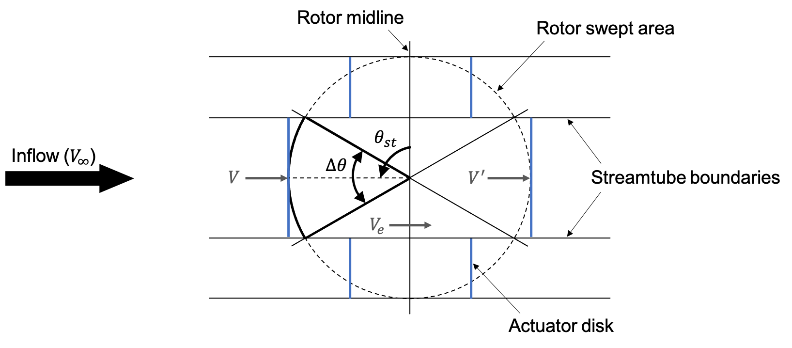

.. _sec:dmst-theory:

DMST Theory
===========

This section details the DMST theory implemented in AeroDyn. An overview of the theory is presented, followed by an explanation of the coordinate systems used, a list of model assumptions and limitations, an outline of the derivation and relevant equations, and a summary of the solution method.

.. _sec:dmst-theory-overview:

Overview
--------

DMST models divide the swept area of a vertical-axis turbine rotor into multiple streamtubes parallel to the inflow direction, as shown in figure :numref:`fig:dmst-streamtubes`. Each streamtube is further divided along the midline of the rotor, separating the upstream and downstream blade sweeps. Within each streamtube, turbine dynamics are represented by a pair of actuator disks. Separating the upstream and downstream blade sweeps allows DMST models to account for the passage of downstream blades through the wake of upstream blades, improving their performance compared to single streamtube models.

   Swept area of a vertical-axis turbine rotor divided into multiple streamtubes. Actuator disks, shown in blue, represent turbine dynamics within each streamtube. 

The influence of the rotor on inflow velocities is accounted for through the use of upstream and downstream induction factors. Induction factors vary with azimuthal position but are assumed constant within a streamtube. Applying both blade element theory and linear momentum theory within each streamtube yields an iterative procedure to solve for the induction factors. Blade element theory can then be used to estimate the average power, thrust, and torque coefficients for each streamtube. Summing the contributions of all streamtubes within a vertical rotor section and then summing all vertical sections, if applicable, gives the overall power, thrust, and torque coefficients for the rotor for a given set of operating conditions.

.. _sec:dmst-theory-coords:

Coordinate Systems
------------------

.. _sec:dmst-theory-assumptions:

Assumptions
-----------

The DMST model implemented in AeroDyn assumes \**insert geometry and operating condition assumptions.\** The model is based on blade element and linear momentum theories, so it also assumes \**list blade element and linear momentum assumptions\**. 

.. _sec:dmst-theory-derivation:

Model Derivation
----------------

As mentioned in :numref:`sec:dmst-theory-overview`, the DMST model is applied by first dividing the rotor swept area into multiple streamtubes in the lateral direction. These streamtubes are further divided into upstream and downstream halves. If desired, the swept area can also be divided in the vertical direction, and the solver can be applied to each vertical section separately. Dividing the swept area in the vertical direction allows for vertical variations in the free-stream velocity and \**rotor geometry\**. 

For each vertical section, the induced velocities in each streamtube are represented as functions of the upstream and downstream induction factors. The upstream induced velocity is given as

.. math::
   \begin{aligned}
   V = uV_\infty,
   \end{aligned}
   :label: eq:dmst-V

the equilibrium induced velocity between the upstream and downstream halves is given as

.. math::
   \begin{aligned}
   V_e = (2u-1)V_\infty,
   \end{aligned}
   :label: eq:dmst-Ve

and the downstream induced velocity is given as 

 .. math::
   \begin{aligned}
   V^\prime &= u^\prime V_e \\
   V^\prime &= u^\prime (2u-1)V_\infty.
   \end{aligned}
   :label: eq:dmst-Vprime

To solve for the induction factors, blade element and linear momentum theories are applied within each streamtube. Blade element theory requires information about the blade geometry and flow field. Specifically, the relative velocity and angle of attack must be calculated. The relative velocity is the vector sum of the induced velocity and tangential rotor velocity. For the upstream sweep, it is given as

.. math::
   \begin{aligned}
   V_{rel} = V\sqrt{1+2\lambda \cos \theta +\lambda^2},
   \end{aligned}
   :label: eq:dmst-Vrel

where :math:`\lambda` is defined as

.. math::
   \begin{aligned}
   \lambda = \frac{\omega R}{V}.
   \end{aligned}
   :label: eq:dmst-lambda

Similarly, the downstream relative velocity is given as

.. math::
   \begin{aligned}
   V_{rel}^\prime = V^\prime\sqrt{1+2\lambda^\prime \cos \theta +\lambda^{\prime 2}},
   \end{aligned}
   :label: eq:dmst-Vrelprime

where :math:`\lambda^\prime` is defined as

.. math::
   \begin{aligned}
   \lambda^\prime = \frac{\omega R}{V^\prime}.
   \end{aligned}
   :label: eq:dmst-lambdaprime

The angle of attack for the upstream sweep can be calculated as

.. math::
   \begin{aligned}
   \alpha = \arctan {\bigg(\frac{\sin \theta}{\lambda + \cos \theta}\bigg)}+\alpha_p,
   \end{aligned}
   :label: eq:dmst-alpha

and the angle of attack for the downstream sweep as

.. math::
   \begin{aligned}
   \alpha^\prime = \arctan {\bigg(\frac{\sin \theta}{\lambda^\prime + \cos \theta}\bigg)}+\alpha_p.
   \end{aligned}
   :label: eq:dmst-alphaprime

Blade element theory also requires knowledge of the normal and tangential force coefficients, defined for the upstream sweep as

.. math::
   \begin{aligned}
   C_n = C_D \sin \phi + C_L \cos \phi
   \end{aligned}
   :label: eq:dmst-Cn

and

.. math::
   \begin{aligned}
   C_t = C_D \cos \phi - C_L \sin \phi,
   \end{aligned}
   :label: eq:dmst-Ctan

where the inflow angle is given as

.. math::
   \begin{aligned}
   \phi = \alpha - \alpha_p.
   \end{aligned}
   :label: eq:dmst-phi

The downstream normal and tangential force coefficients are defined as

.. math::
   \begin{aligned}
   C_n^\prime = C_D^\prime \sin \phi^\prime + C_L^\prime \cos \phi^\prime
   \end{aligned}
   :label: eq:dmst-Cnprime

and

.. math::
   \begin{aligned}
   C_t^\prime = C_D^\prime \cos \phi^\prime - C_L^\prime \sin \phi^\prime,
   \end{aligned}
   :label: eq:dmst-Ctanprime

where the inflow angle is given as

.. math::
   \begin{aligned}
   \phi^\prime = \alpha^\prime - \alpha_p.
   \end{aligned}
   :label: eq:dmst-phiprime

As shown in Eqs. :eq:`eq:dmst-Cn`-:eq:`eq:dmst-phiprime`, the normal and tangential force coefficients depend on the blade lift and drag coefficients. These values are typically given in tabulated form as functions of the angle of attack and blade Reynolds number, which is defined as

.. math::
   \begin{aligned}
   Re_b = \frac{V_{rel}c}{\nu}
   \end{aligned}
   :label: eq:dmst-Re

for the upstream sweep and 

.. math::
   \begin{aligned}
   Re_b^\prime = \frac{V_{rel}^\prime c}{\nu}
   \end{aligned}
   :label: eq:dmst-Reprime

for the downstream sweep. When looking up tabulated lift and drag coefficients, the local blade Reynolds number of the turbine should match the Reynolds number of the airfoil data calculated using the free-stream velocity and blade chord.

Given the relative velocity and normal and tangential force coefficients, blade element theory can be applied to each streamtube to calculate the average thrust coefficient for that streamtube, given as

.. math::
   \begin{aligned}
   \overline{C_T}_i = \frac{Nc}{\pi R \Delta \theta \sin \theta_{st} V_\infty ^2}\int\limits_{\theta_{st}-\frac{\Delta \theta}{2}}^{\theta_{st}+\frac{\Delta \theta}{2}} V_{rel}^2 [C_t \cos \theta + C_n \sin \theta]~\mathrm{d}\theta
   \end{aligned}
   :label: eq:dmst-betCT

for the upstream sweep and 

.. math::
   \begin{aligned}
   \overline{C^\prime_T}_i = \frac{Nc}{\pi R \Delta \theta \sin \theta_{st} V_e ^2}\int\limits_{\theta_{st}-\frac{\Delta \theta}{2}}^{\theta_{st}+\frac{\Delta \theta}{2}} V_{rel}^{\prime 2} [C_t^\prime \cos \theta + C_n^\prime \sin \theta]~\mathrm{d}\theta
   \end{aligned}
   :label: eq:dmst-betCTprime

for the downstream sweep. Applying linear momentum theory to each streamtube yields a second, independent expression for the average thrust coefficient, given as

.. math::
   \begin{aligned}
   \overline{C_T}_i = 4u(1-u)
   \end{aligned}
   :label: eq:dmst-lmCT

for the upstream sweep and 

.. math::
   \begin{aligned}
   \overline{C^\prime_T}_i = 4u^\prime(1-u^\prime)
   \end{aligned}
   :label: eq:dmst-lmCTprime

for the downstream sweep. Eqs. :eq:`eq:dmst-betCT`-:eq:`eq:dmst-lmCTprime` are solved iteratively for the upstream and downstream induction factors. The average power and torque coefficients for a given streamtube can then be calculated. The average power coefficient for the upstream sweep within a streamtube is given as

.. math::
   \begin{aligned}
   \overline{C_P}_i = \frac{Nc\omega}{\pi \Delta \theta \sin \theta_{st} V_\infty ^3}\int\limits_{\theta_{st}-\frac{\Delta \theta}{2}}^{\theta_{st}+\frac{\Delta \theta}{2}} V_{rel}^2 C_t~\mathrm{d}\theta,
   \end{aligned}
   :label: eq:dmst-CP

and the average power coefficient for the downstream sweep is given as

.. math::
   \begin{aligned}
   \overline{C_P^\prime}_i = \frac{Nc\omega}{\pi \Delta \theta \sin \theta_{st} V_e ^3}\int\limits_{\theta_{st}-\frac{\Delta \theta}{2}}^{\theta_{st}+\frac{\Delta \theta}{2}} V_{rel}^{\prime 2} C_t^\prime~\mathrm{d}\theta.
   \end{aligned}
   :label: eq:dmst-CPprime

Similarly, the average torque coefficient for the upstream sweep within a streamtube is given as

.. math::
   \begin{aligned}
   \overline{C_Q}_i = \frac{Nc}{\pi R \Delta \theta \sin \theta_{st} V_\infty ^2}\int\limits_{\theta_{st}-\frac{\Delta \theta}{2}}^{\theta_{st}+\frac{\Delta \theta}{2}} V_{rel}^2 C_t~\mathrm{d}\theta,
   \end{aligned}
   :label: eq:dmst-CQ

and the average torque coefficient for the downstream sweep is given as

.. math::
   \begin{aligned}
   \overline{C_Q^\prime}_i = \frac{Nc}{\pi R \Delta \theta \sin \theta_{st} V_e ^2}\int\limits_{\theta_{st}-\frac{\Delta \theta}{2}}^{\theta_{st}+\frac{\Delta \theta}{2}} V_{rel}^{\prime 2} C_t^\prime~\mathrm{d}\theta.
   \end{aligned}
   :label: eq:dmst-CQprime

The average power (or thrust or torque) coefficient for the upstream half of the blade sweep is calculated by summing the contributions from the upstream portion of each streamtube,

.. math::
   \begin{aligned}
   \overline{C_P}_{up,~m} = \sum_{i=1}^{N_{st}} \overline{C_P}_i.
   \end{aligned}
   :label: eq:dmst-CPup

Similarly, the average power (or thrust or torque) coefficient for the downstream half of the blade sweep is calculated by summing the contributions from the downstream portion of each streamtube,

.. math::
   \begin{aligned}
   \overline{C_P}_{down,~m} = \sum_{i=1}^{N_{st}} \overline{C_P^\prime}_i.
   \end{aligned}
   :label: eq:dmst-CPdown

The average power (or thrust or torque) coefficient for each vertical section is determined by summing the upstream and downstream contributions,

.. math::
   \begin{aligned}
   \overline{C_P}_{sec,~m} = \overline{C_P}_{up,~m} + \overline{C_P}_{down,~m}.
   \end{aligned}
   :label: eq:dmst-CPsec

Finally, if the rotor swept area was divided into muptiple vertical sections, the average power (or thrust or torque) coefficients from each section should be summed to give the total rotor value,

.. math::
   \begin{aligned}
   \overline{C_P}_{rotor} = \sum_{m=1}^{N_{sec}} \overline{C_P}_{sec,~m}.
   \end{aligned}
   :label: eq:dmst-CProtor

Solution Method
---------------