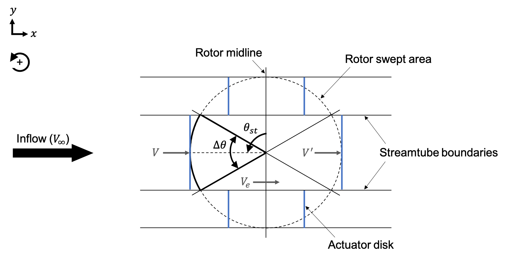
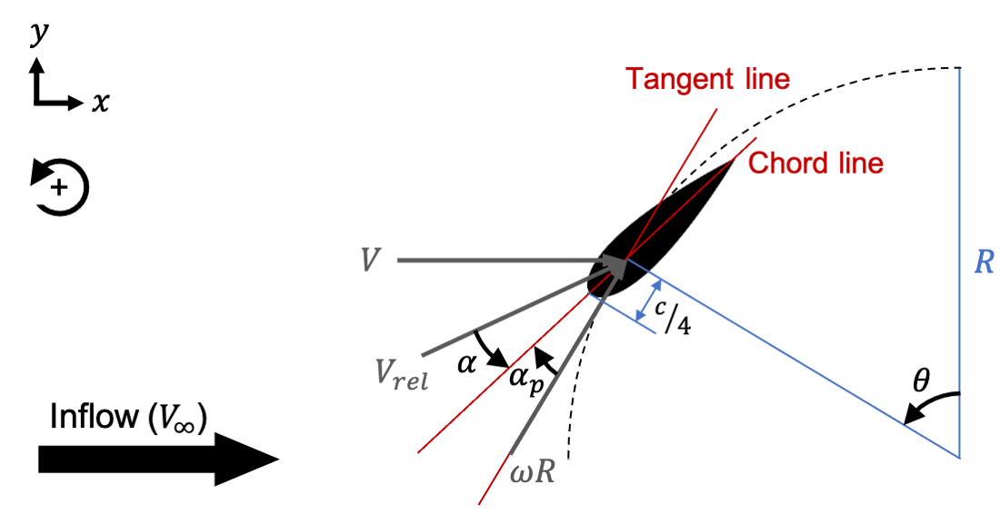
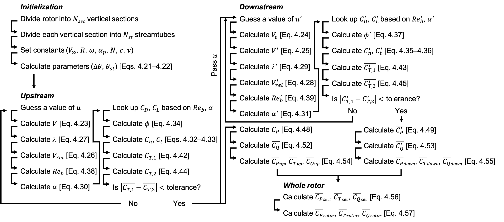

.. _sec:dmst-theory:

DMST Theory
===========

This section details the DMST theory implemented in AeroDyn. An overview of the theory is presented, followed by an explanation of the coordinate systems used, a list of model assumptions and limitations, an outline of the derivation and relevant equations, and a summary of the solution method.

.. _sec:dmst-theory-overview:

Overview
--------

DMST models divide the swept area of a vertical-axis turbine rotor into multiple streamtubes parallel to the inflow direction, as shown in :numref:`fig:dmst-streamtubes`. Each streamtube is further divided along the midline of the rotor, separating the upstream and downstream blade sweeps. Within each streamtube, turbine dynamics are represented by a pair of actuator disks. Separating the upstream and downstream blade sweeps allows DMST models to account for the passage of downstream blades through the wake of upstream blades, improving their performance compared to single streamtube models.

   Swept area of a vertical-axis turbine rotor divided into multiple streamtubes. Actuator disks, shown in blue, represent turbine dynamics within each streamtube. 

The influence of the rotor on inflow velocities is accounted for through the use of upstream and downstream induction factors. Induction factors vary with azimuthal position but are assumed constant within a streamtube. Applying both blade element theory and linear momentum theory within each streamtube yields an iterative procedure to solve for the induction factors. Blade element theory can then be used to estimate the average power, thrust, and torque coefficients for each streamtube. Summing the contributions of all streamtubes within a vertical rotor section and then summing all vertical sections, if applicable, gives the overall power, thrust, and torque coefficients for the rotor for a given set of operating conditions.

.. _sec:dmst-theory-coords:

Coordinate Systems
------------------

The coordinate systems used in this implementation of DMST theory are illustrated in :numref:`fig:dmst-coords1` and :numref:`fig:dmst-coords2`. Inflow is assumed to be unidirectional, with the free-stream and induced velocities positive as shown. All schematics show a top view, with the positive vertical direction pointing out of the page. The tangential velocity :math:`\omega R` acts along the line tangent to the blade sweep, and the relative velocity is the vector sum of the induced and tangential velocities. The angle of attack is defined from the relative velocity vector to the chord line. The preset pitch angle is defined from the tangent line to the chord line. All angles are defined as positive in the counterclockwise direction, so the preset pitch angle is negative as shown, with the leading edge rotated outward. If the preset pitch angle is zero, the tangent and chord lines align. The radius is defined from the axis of rotation to the quarter chord of the blade, which is the reference position for all velocities and forces. The azimuthal blade position is defined as zero when the blade is pointing directly upstream. The inflow angle is the angle between the relative velocity vector and the tangent line. The normal and tangential forces act perpendicular and parallel to the tangent line, respectively. The lift and drag forces act perpendicular and parallel to the relative velocity vector, respectively. All forces are positive as shown.

   The coordinate system used for the angles and velocities in this implementation of DMST theory.

.. figure:: figures/dmst-coords2.png
   :alt: Coordinate system used for the forces.
   :name: fig:dmst-coords2
   :width: 65.0%

   The coordinate system used for the forces in this implementation of DMST theory.

.. _sec:dmst-theory-assumptions:

Assumptions
-----------

The DMST model implemented in AeroDyn assumes \**insert geometry and operating condition assumptions.\** The model is based on blade element and linear momentum theories, so it also assumes \**list blade element and linear momentum assumptions\**. 

.. _sec:dmst-theory-derivation:

Model Derivation
----------------

As mentioned in :numref:`sec:dmst-theory-overview`, the DMST model is applied by first dividing the rotor swept area into multiple streamtubes in the lateral direction. These streamtubes are further divided into upstream and downstream halves. If desired, the swept area can also be divided in the vertical direction, and the solver can be applied to each vertical section separately. Dividing the swept area in the vertical direction allows for vertical variations in the free-stream velocity and \**rotor geometry\**. The total streamtube angle is defined as 

.. math::
   \begin{aligned}
   \Delta \theta = \frac{\pi}{N_{st}},
   \end{aligned}
   :label: eq:dmst-Dtheta

and the azimuthal position of the streamtube midpoint is calculated as 

.. math::
   \begin{aligned}
   \theta_{st} = \frac{\Delta \theta}{2} + \Delta \theta~(i-1)
   \end{aligned}
   :label: eq:dmst-thetast

for the upstream sweep and 

.. math::
   \begin{aligned}
   \theta_{st}^\prime = \theta_{st} + \pi
   \end{aligned}
   :label: eq:dmst-thetastprime

for the downstream sweep, where :math:`i=1:N_{st}`. For each vertical section, the induced velocities in each streamtube are represented as functions of the upstream and downstream induction factors. The upstream induced velocity is given as

.. math::
   \begin{aligned}
   V = uV_\infty,
   \end{aligned}
   :label: eq:dmst-V

the equilibrium induced velocity between the upstream and downstream halves is given as

.. math::
   \begin{aligned}
   V_e = (2u-1)V_\infty,
   \end{aligned}
   :label: eq:dmst-Ve

and the downstream induced velocity is given as 

 .. math::
   \begin{aligned}
   V^\prime &= u^\prime V_e \\
   V^\prime &= u^\prime (2u-1)V_\infty.
   \end{aligned}
   :label: eq:dmst-Vprime

To solve for the induction factors, blade element and linear momentum theories are applied within each streamtube. Blade element theory requires information about the blade geometry and flow field. Specifically, the relative velocity and angle of attack must be calculated. The relative velocity is the vector sum of the induced velocity and tangential rotor velocity. For the upstream sweep, it is given as

.. math::
   \begin{aligned}
   V_{rel} = V\sqrt{1+2\lambda \cos \theta_{st} +\lambda^2},
   \end{aligned}
   :label: eq:dmst-Vrel

where :math:`\lambda` is defined as

.. math::
   \begin{aligned}
   \lambda = \frac{\omega R}{V}.
   \end{aligned}
   :label: eq:dmst-lambda

Similarly, the downstream relative velocity is given as

.. math::
   \begin{aligned}
   V_{rel}^\prime = V^\prime\sqrt{1+2\lambda^\prime \cos \theta_{st}^\prime +\lambda^{\prime 2}},
   \end{aligned}
   :label: eq:dmst-Vrelprime

where :math:`\lambda^\prime` is defined as

.. math::
   \begin{aligned}
   \lambda^\prime = \frac{\omega R}{V^\prime}.
   \end{aligned}
   :label: eq:dmst-lambdaprime

The angle of attack for the upstream sweep can be calculated as

.. math::
   \begin{aligned}
   \alpha = \arctan {\bigg(\frac{\sin \theta_{st}}{\lambda + \cos \theta_{st}}\bigg)}+\alpha_p,
   \end{aligned}
   :label: eq:dmst-alpha

and the angle of attack for the downstream sweep as

.. math::
   \begin{aligned}
   \alpha^\prime = \arctan {\bigg(\frac{\sin \theta_{st}^\prime}{\lambda^\prime + \cos \theta_{st}^\prime}\bigg)}+\alpha_p.
   \end{aligned}
   :label: eq:dmst-alphaprime

Blade element theory also requires knowledge of the normal and tangential force coefficients, defined for the upstream sweep as

.. math::
   \begin{aligned}
   C_n = C_D \sin \phi + C_L \cos \phi
   \end{aligned}
   :label: eq:dmst-Cn

and

.. math::
   \begin{aligned}
   C_t = C_D \cos \phi - C_L \sin \phi,
   \end{aligned}
   :label: eq:dmst-Ctan

where the inflow angle is given as

.. math::
   \begin{aligned}
   \phi = \alpha - \alpha_p.
   \end{aligned}
   :label: eq:dmst-phi

The downstream normal and tangential force coefficients are defined as

.. math::
   \begin{aligned}
   C_n^\prime = C_D^\prime \sin \phi^\prime + C_L^\prime \cos \phi^\prime
   \end{aligned}
   :label: eq:dmst-Cnprime

and

.. math::
   \begin{aligned}
   C_t^\prime = C_D^\prime \cos \phi^\prime - C_L^\prime \sin \phi^\prime,
   \end{aligned}
   :label: eq:dmst-Ctanprime

where the inflow angle is given as

.. math::
   \begin{aligned}
   \phi^\prime = \alpha^\prime - \alpha_p.
   \end{aligned}
   :label: eq:dmst-phiprime

As shown in Eqs. :eq:`eq:dmst-Cn`-:eq:`eq:dmst-phiprime`, the normal and tangential force coefficients depend on the blade lift and drag coefficients. These values are typically given in tabulated form as functions of the angle of attack and blade Reynolds number, which is defined as

.. math::
   \begin{aligned}
   Re_b = \frac{V_{rel}c}{\nu}
   \end{aligned}
   :label: eq:dmst-Re

for the upstream sweep and 

.. math::
   \begin{aligned}
   Re_b^\prime = \frac{V_{rel}^\prime c}{\nu}
   \end{aligned}
   :label: eq:dmst-Reprime

for the downstream sweep. When looking up tabulated lift and drag coefficients, the local blade Reynolds number of the turbine should match the Reynolds number of the airfoil data calculated using the free-stream velocity and blade chord.

Given the relative velocity and normal and tangential force coefficients, blade element theory can be applied to each streamtube to calculate the average thrust coefficient for that streamtube, given as

.. math::
   \begin{aligned}
   \overline{C_{T,1}}_i = \frac{Nc}{\pi R \Delta \theta \sin \theta_{st} V_\infty ^2}\int\limits_{\theta_{st}-\frac{\Delta \theta}{2}}^{\theta_{st}+\frac{\Delta \theta}{2}} V_{rel}^2 [C_t \cos \theta + C_n \sin \theta]~\mathrm{d}\theta
   \end{aligned}
   :label: eq:dmst-betCT

for the upstream sweep and 

.. math::
   \begin{aligned}
   \overline{C^\prime_{T,1}}_i = \frac{Nc}{\pi R \Delta \theta \sin \theta_{st}^\prime V_e ^2}\int\limits_{\theta_{st}^\prime-\frac{\Delta \theta}{2}}^{\theta_{st}^\prime+\frac{\Delta \theta}{2}} V_{rel}^{\prime 2} [C_t^\prime \cos \theta + C_n^\prime \sin \theta]~\mathrm{d}\theta
   \end{aligned}
   :label: eq:dmst-betCTprime

for the downstream sweep. As :math:`N_{st} \rightarrow \infty`, the average thrust coefficient for a streamtube reduces to

.. math::
   \begin{aligned}
   \overline{C_{T,1}}_i = \frac{NcV_{rel}^2}{\pi R \sin \theta_{st} V_\infty ^2} (C_t \cos \theta_{st} + C_n \sin \theta_{st})
   \end{aligned}
   :label: eq:dmst-betCTnoint

for the upstream sweep and 

.. math::
   \begin{aligned}
   \overline{C^\prime_{T,1}}_i = \frac{NcV_{rel}^{\prime 2}}{\pi R \sin \theta_{st}^\prime V_e ^2} (C_t^\prime \cos \theta_{st}^\prime + C_n^\prime \sin \theta_{st}^\prime)
   \end{aligned}
   :label: eq:dmst-betCTprimenoint

for the downstream sweep. Applying linear momentum theory to each streamtube yields a second, independent expression for the average thrust coefficient, given as

.. math::
   \begin{aligned}
   \overline{C_{T,2}}_i = 4u(1-u)
   \end{aligned}
   :label: eq:dmst-lmCT

for the upstream sweep and 

.. math::
   \begin{aligned}
   \overline{C^\prime_{T,2}}_i = 4u^\prime(1-u^\prime)
   \end{aligned}
   :label: eq:dmst-lmCTprime

for the downstream sweep. Eqs. :eq:`eq:dmst-betCTnoint`-:eq:`eq:dmst-lmCTprime` are solved iteratively for the upstream and downstream induction factors. The average power and torque coefficients for a given streamtube can then be calculated. The average power coefficient for the upstream sweep within a streamtube is given as

.. math::
   \begin{aligned}
   \overline{C_P}_i = \frac{Nc\omega}{\pi \Delta \theta \sin \theta_{st} V_\infty ^3}\int\limits_{\theta_{st}-\frac{\Delta \theta}{2}}^{\theta_{st}+\frac{\Delta \theta}{2}} V_{rel}^2 C_t~\mathrm{d}\theta,
   \end{aligned}
   :label: eq:dmst-CP

and the average power coefficient for the downstream sweep is given as

.. math::
   \begin{aligned}
   \overline{C_P^\prime}_i = \frac{Nc\omega}{\pi \Delta \theta \sin \theta_{st}^\prime V_e ^3}\int\limits_{\theta_{st}^\prime-\frac{\Delta \theta}{2}}^{\theta_{st}^\prime+\frac{\Delta \theta}{2}} V_{rel}^{\prime 2} C_t^\prime~\mathrm{d}\theta.
   \end{aligned}
   :label: eq:dmst-CPprime

As before, as :math:`N_{st} \rightarrow \infty`, the average power coefficient for a streamtube reduces to

.. math::
   \begin{aligned}
   \overline{C_P}_i = \frac{Nc\omega V_{rel}^2 C_t}{\pi \sin \theta_{st} V_\infty ^3}
   \end{aligned}
   :label: eq:dmst-CPnoint

for the upstream sweep and

.. math::
   \begin{aligned}
   \overline{C_P^\prime}_i = \frac{Nc\omega V_{rel}^{\prime 2} C_t^\prime}{\pi \sin \theta_{st}^\prime V_e ^3}
   \end{aligned}
   :label: eq:dmst-CPnointprime

for the downstream sweep. Similarly, the average torque coefficient for the upstream sweep within a streamtube is given as

.. math::
   \begin{aligned}
   \overline{C_Q}_i = \frac{Nc}{\pi R \Delta \theta \sin \theta_{st} V_\infty ^2}\int\limits_{\theta_{st}-\frac{\Delta \theta}{2}}^{\theta_{st}+\frac{\Delta \theta}{2}} V_{rel}^2 C_t~\mathrm{d}\theta,
   \end{aligned}
   :label: eq:dmst-CQ

and the average torque coefficient for the downstream sweep is given as

.. math::
   \begin{aligned}
   \overline{C_Q^\prime}_i = \frac{Nc}{\pi R \Delta \theta \sin \theta_{st}^\prime V_e ^2}\int\limits_{\theta_{st}^\prime-\frac{\Delta \theta}{2}}^{\theta_{st}^\prime+\frac{\Delta \theta}{2}} V_{rel}^{\prime 2} C_t^\prime~\mathrm{d}\theta.
   \end{aligned}
   :label: eq:dmst-CQprime

Again, as :math:`N_{st} \rightarrow \infty`, the average torque coefficient for a streamtube reduces to

.. math::
   \begin{aligned}
   \overline{C_Q}_i = \frac{NcV_{rel}^2 C_t}{\pi R \sin \theta_{st} V_\infty ^2}
   \end{aligned}
   :label: eq:dmst-CQnoint

for the upstream sweep and

.. math::
   \begin{aligned}
   \overline{C_Q^\prime}_i = \frac{NcV_{rel}^{\prime 2} C_t^\prime}{\pi R \sin \theta_{st}^\prime V_e ^2}
   \end{aligned}
   :label: eq:dmst-CQnointprime

for the downstream sweep. The average power (or thrust or torque) coefficient for the upstream half of the blade sweep is calculated by summing the contributions from the upstream portion of each streamtube,

.. math::
   \begin{aligned}
   \overline{C_P}_{up,~m} = \sum_{i=1}^{N_{st}} \overline{C_P}_i.
   \end{aligned}
   :label: eq:dmst-CPup

Similarly, the average power (or thrust or torque) coefficient for the downstream half of the blade sweep is calculated by summing the contributions from the downstream portion of each streamtube,

.. math::
   \begin{aligned}
   \overline{C_P}_{down,~m} = \sum_{i=1}^{N_{st}} \overline{C_P^\prime}_i.
   \end{aligned}
   :label: eq:dmst-CPdown

The average power (or thrust or torque) coefficient for each vertical section is determined by summing the upstream and downstream contributions,

.. math::
   \begin{aligned}
   \overline{C_P}_{sec,~m} = \overline{C_P}_{up,~m} + \overline{C_P}_{down,~m}.
   \end{aligned}
   :label: eq:dmst-CPsec

Finally, if the rotor swept area was divided into muptiple vertical sections, the average power (or thrust or torque) coefficients from each section should be summed to give the total rotor value,

.. math::
   \begin{aligned}
   \overline{C_P}_{rotor} = \sum_{m=1}^{N_{sec}} \overline{C_P}_{sec,~m}.
   \end{aligned}
   :label: eq:dmst-CProtor

.. _sec:dmst-theory-solution:

Solution Method
---------------

A summary of the iterative solution method used in this implementation of DMST theory is given by the flowchart presented in :numref:`fig:dmst-solution`. 

   Iterative solution method used to implement the DMST theory.